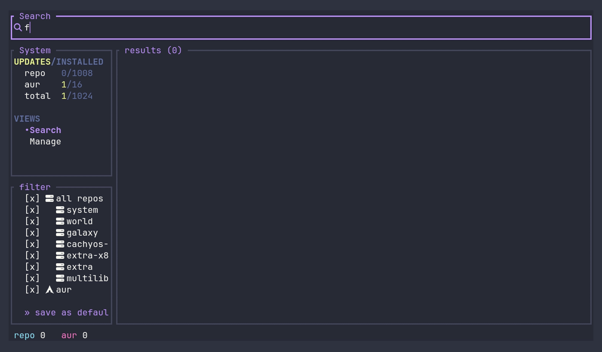

# Plaza



## there will be no updates between 16th Jul and 4th Aug as im going on summer holidays.

Plaza is a customizable, riceable terminal UI for finding, installing, and
managing packages. You search once and it queries every package source on the
system at the same time, then merges the results into one list so a package shows
up a single time even when several sources provide it. A separate Manage view
lists everything installed, marks what has updates, and removes or upgrades
without leaving Plaza. Every action runs in a background pane backed by a real
terminal, so you keep working while one runs.

Plaza adapts to the machine it runs on: it shows only the sources and controls
that fit the system, so Arch-specific options never appear on Debian or Fedora,
and the reverse.

## Supported sources

| System | Sources |
| --- | --- |
| Arch | pacman (official repos) and the AUR |
| Debian and Ubuntu | apt |
| Fedora | dnf |
| Any of the above | Flatpak (Flathub), when a remote is configured |

Search, detail, install, removal, and upgrade all work for every enabled source.
The backends sit behind a `Source` trait, so zypper, snap, and others can be
added later.

## Search

- Queries every source at once and merges packages with the same name into one
  row. Results stream in as each source replies, so a slow or offline source
  never blocks the rest.
- Groups name variants (`gimp`, `gimp-bin`, `gimp-git`) and a name-matching
  Flatpak into a single row; you pick the edition from the detail view. Flatpak
  matching uses the app ID, then a normalized name (multi-word app names stay on
  their own to avoid wrong merges). Two independent options control this: "Stack
  package variants" (the `-bin`/`-git` family) and "Group matching Flatpak". Turn
  either off for one row per exact name.
- Shows every repo or source that provides a package, with versions and what is
  already installed. The repo the native tool installs from by default is marked,
  and you can install from a specific repo instead.
- A grouped row shows one badge per source. When several variants share a source,
  the "Variant badge" option renders them as a count (`aur ×3`, the default) or
  repeated (`aur aur aur`). Badges carry the skin's per-source icon when icons are
  enabled.
- Flags AUR packages whose PKGBUILD changed in the last seven days.

## Manage

- Lists every installed package with its origin repo (or `aur`), filterable by
  typing. Upgradable packages are marked with the new version.
- Sorts the list by name, size, or last install/upgrade date from the filter box
  (`f`) `sort` section. The active key shows a direction arrow; pick it again to
  flip ascending and descending. "Float upgradable to top" (on by default) keeps
  upgradable packages above the sorted order.
- Removes the selected package at a configurable depth. On Arch that is `-Rs` by
  default (also `-Rns` or `-R`); apt maps the depth to its own verbs; dnf removes
  the package directly.
- Upgrades per source or all at once from the sidebar `UPDATES/INSTALLED` block:
  press Enter on a source row to upgrade that source, or on the `total` row to
  upgrade everything. "All" chains each source into one task. Press Enter on an
  upgradable package in the list for a small menu (upgrade just that package,
  remove it, or cancel); on an up-to-date package Enter goes straight to remove.
  Press `u` from anywhere to jump to the sidebar upgrade block with the cursor on
  `total`, so a following Enter upgrades all.
- Shows a detail pane beside the list using the native query (`pacman -Qi`,
  `rpm -qi`, or dpkg): version, install and build date, size, install reason
  (explicit or dependency), what requires it, and what it depends on. It follows
  the selection and hides on narrow terminals.
- Filters by installation reason from the filter box: all, explicitly installed
  only, or orphans (dependencies nothing requires). Save the current reason, sort,
  and filter as the launch default with `s`.

## Actions and the queue

- Actions run in a background pane backed by a real terminal, so sudo prompts and
  AUR build questions work normally. A hotkey returns you to the pane.
- Confirming an action adds it to a queue. The queue runs one task at a time,
  advances on its own when a task succeeds, and pauses on a failure for you to
  dismiss or clear. Auto-advance does not pull you back to the pane, and queued
  items can be removed one at a time.
- When a running task stops at a prompt (a sudo password, a package-manager
  question) and you are not on the pane, the status bar tells you it is waiting
  for input and which key opens the pane to answer.

## Cache cleanup

- A `CACHE` sidebar block shows each present source's package-cache size (and,
  for Flatpak, its unused-runtime count) plus a total. It is hidden by default;
  press `c` to open it, or set "Cache block" (in Options, under Appearance) to
  keep it visible while idle, either concise (one total row) or full (one row
  per source). Focusing the block always shows the full, row-per-source form
  regardless of the idle setting.
- Press Enter on a source row to clean that source, after the normal confirm
  step. Enter on the `total` row chains a clean of every available source into
  one task; sources whose tool is missing are dropped from the chain instead of
  failing it.
- Cleaning goes through each source's own tool: `paccache -rk<N>` for pacman
  (needs pacman-contrib), the AUR helper's `-Sc --aur` for the AUR build cache,
  apt's `autoclean` (keep-N above zero) or `clean` (keep-N at zero), dnf's
  `clean packages`, and `flatpak uninstall --unused --user` for unused
  runtimes. "Keep cached versions: N" (Options, General) sets N for pacman
  directly; apt only distinguishes zero from non-zero, and dnf and Flatpak
  ignore it since neither keeps versioned cache entries.
- "Auto clean cache after install/upgrade" (Options, General, off by default)
  queues a clean for a source once its install or upgrade finishes and no other
  task for that source is still queued, so a run of several installs from one
  source gets a single trailing clean rather than one per install. The queued
  clean uses each tool's non-interactive form so it never stalls waiting for a
  prompt.

## Filtering, options, and more

- Filter either list by repository. Press `f` for a checkbox box in the sidebar to
  show only the sources or repos you pick (one repo, all pacman repos at once, or
  a whole source like the AUR, apt, dnf, or Flatpak). In Manage the box also holds
  the reason and sort sections. Search and Manage keep separate filters, so hiding
  a repo in one view does not affect the other. Press `s` in the box to save the
  current view's filter as its launch default. By default the box appears only
  while you are in it or a filter is active; turn off "hide filter box when not in
  use" to keep it visible.
- A small options menu (press `o`), grouped into Appearance, Search, Manage,
  Filters, and General: hide the keybinding hints, collapse all repos into one
  `[official]` badge, switch palette and skin (see [Theming](#theming)), set the
  cache block's idle visibility (hidden, concise, or full), set the search
  delay, pick the remove depth, choose the AUR helper (auto, yay, or paru),
  toggle variant stacking and Flatpak grouping, pick the variant-badge style,
  float upgradable packages to the top of Manage, choose whether the filter box
  hides when idle, set how the matched substring is drawn (off, color, underline,
  or both), turn notifications on or off, turn auto clean cache after
  install/upgrade on or off, and set how many cached versions it keeps. Settings
  are saved to `~/.config/plaza/settings.json`.
- Desktop notifications (via `notify-send`, on by default): when a background task
  finishes or stops for input while you are not watching its pane, Plaza notifies
  you so a forgotten install never sits silently at a prompt.
- Update check (on by default): at startup Plaza asks the GitHub releases API once
  whether a newer version exists and, if so, shows a note in the sidebar. Turning
  the option off stops the network call entirely.

## Requirements

On Debian and Ubuntu, apt and dpkg are all Plaza needs, and both are part of the
base system. On Fedora, dnf and rpm are likewise all it needs. The rest applies to
Arch:

- pacman, for official-repo search, install, and removal
- an AUR helper (yay or paru), for AUR installs and upgrades. AUR search itself
  needs no helper; with neither installed you can still browse AUR results
- checkupdates (from pacman-contrib), for live update counts without root, and
  cache cleaning via paccache
- flatpak with a remote configured (optional), to search and install from Flatpak.
  Installs use `--user`. With no remote, the Flatpak source stays off

Building from source needs Rust and Cargo.

## Install

On Debian or Ubuntu, download the `.deb` from the
[latest release](https://github.com/StaszeKrk/plaza/releases/latest) and:

```sh
sudo apt install ./plaza_*.deb
```

On Fedora, download the `.rpm` from the
[latest release](https://github.com/StaszeKrk/plaza/releases/latest) and:

```sh
sudo dnf install ./plaza-*.rpm
```

On Arch, from the AUR with your preferred helper:

```sh
yay -S plaza
```

Or build the bundled PKGBUILD (tracked by pacman, removable with `pacman -R
plaza`):

```sh
makepkg -si
```

Or build directly with Cargo:

```sh
cargo build --release
./target/release/plaza
```

A headless search is also available:

```sh
plaza --search firefox
```

## Navigation

Plaza has two modes, like a tiling layout you tab around:

- **Navigate**: arrow keys (or `hjkl`) move the highlighted panel. The highlight
  uses the theme's hover border color (amber in the default theme).
- **Interact**: press Enter or Space to focus the highlighted panel. Its border
  turns the theme's active accent color and the arrow keys act inside it (move the
  selection, type in the search box). Press Esc to step back to Navigate.

## Keys

| Key | Action |
| --- | --- |
| type | search (or filter, in Manage); the bar is focused at launch |
| Enter (in search) | run it and focus the results |
| arrows, hjkl | Navigate: move the highlight. Interact: move inside the panel |
| Enter, Space | focus the highlighted panel |
| Esc | step out of the focused panel |
| Tab | switch between the Search and Manage views |
| / | jump to the search bar from anywhere |
| f | open or close the filter box; Space toggles a checkbox |
| s (in the filter box) | save the current view's filter (repos, plus reason and sort in Manage) as its launch default |
| Enter (on a result) | open it, then Enter on a source to install |
| r (in Manage list) | remove the selected package |
| Enter (in Manage list) | open the action menu (upgrade/remove/cancel) if the package has an update, else remove it |
| u | jump to the sidebar upgrade block (cursor on `total`, so Enter upgrades all) |
| Enter (on a sidebar upgrade row) | upgrade that source; Enter on `total` upgrades all |
| c | open or close the cache block; Enter cleans the selected source |
| backtick | open or collapse the action pane |
| j/k, d, x (in the action pane) | move within the queue, remove the selected item, or clear it |
| Ctrl-C in a focused action | cancel that action |
| o | options |
| q | quit; during an action it switches to the action instead |

Search and Manage keep separate search text, so switching views loses neither.

## Theming

Plaza's look is split into two independent, swappable parts:

- a **palette**: the colors
- a **skin**: everything else (border style, corner radius, glyphs and icons, and
  the highlight and badge styles)

Switch either live from the options menu (`o`): the `Palette` and `Skin` rows
cycle through the built-ins plus anything you have added, and the choice is saved
to `~/.config/plaza/settings.json`.

Built-in palettes: `plaza-dusk` (default), `gruvbox`, `nord`, `dracula`,
`tokyo-night`, `solarized-dark`, `catppuccin-mocha`, and `ansi` (which uses your
terminal's own 16 colors, so it follows the terminal's theme). Built-in skins:
`soft` (default), `sharp`, and `plain` (square borders and no Nerd Font glyphs,
for terminals without one).

To make your own, drop a `.toml` file in `~/.config/plaza/palettes/` or
`~/.config/plaza/skins/`; the file name is the theme name. Plaza loads new files
on the next launch, and edits to the active file reload live. A palette may set
only the fields it wants to change; the rest fall back to the default. See
[docs/theming.md](docs/theming.md) for the full format.

## Troubleshooting

If input stalls after the first keypress, your terminal may be advertising kitty
keyboard-protocol support that it does not deliver correctly. Set `PLAZA_NO_KITTY`
in the environment to run Plaza in plain-key mode:

```
PLAZA_NO_KITTY=1 plaza
```

## License

GPL-3.0-or-later. See [LICENSE](LICENSE). Plaza is free software: you can
redistribute it and modify it under the terms of the GNU General Public License as
published by the Free Software Foundation, either version 3 of the License, or (at
your option) any later version.
